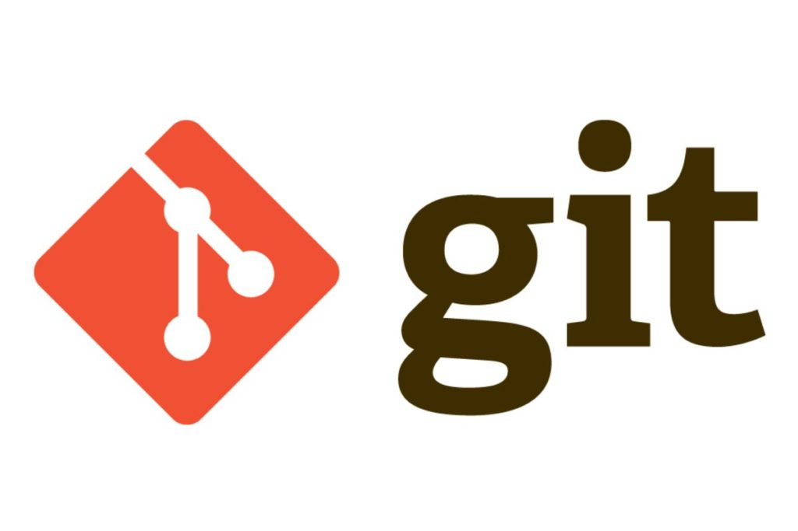

# Работа с Git

## 1. Проверка наличия установленного Git

В терминале выполнить команду `git version`.
Если **Git** установлен, появится сообщение с информацией о версии программы. Иначе будет сообщение об ошибке.

## 2. Установка Git
Загружаем последнюю версию **Git** с [сайта](https://git-scm.com/downloads) или сайта https://git-scm.com/downloads 

## 3. Настройка Git
При первом использовании **Git** необходимо представиться. Для этого нужно ввести в терминале две команды:
```
git config --global user.name "Ваше имя"
git config --global user.email "Ваш email"
```
## 4. Создание Git-репозитория
Для создания **Git-репозитория** вы можете использовать два основных подхода. Во-первых,
импорт в **Git** уже существующего проекта или директории. Во-вторых, клонирование
существующего репозитория с другого сервера.
### `Создание репозитория в существующей директории`
Если вы собираетесь начать использовать **Git** для существующего проекта, то вам
необходимо перейти в директорию проекта и в командной строке ввести
```
 git init
```
Эта команда создаёт в текущей директории новую поддиректорию с именем `.git`,
содержащую все необходимые файлы репозитория — основу **Git-репозитория**. На этом этапе
ваш проект ещё не находится под версионным контролем. 
Если вы хотите добавить под версионный контроль существующие файлы (в отличие от
пустого каталога), вам стоит добавить их в индекс и осуществить первый коммит
изменений. Добиться этого вы сможете запустив команду `git add` несколько раз, указав
индексируемые файлы, а затем выполнив `git commit`:
```
git add *.c
git add LICENSE
git commit -m 'initial project version'
```
Мы разберем, что делают эти команды чуть позже. Теперь у вас есть **Git-репозиторий** с
отслеживаемыми файлами и начальным коммитом.
### `Клонирование существующего репозитория`
Для получения копии существующего **Git-репозитория**, например, проекта, в который вы
хотите внести свой вклад, необходимо использовать команду `git clone`. Если вы знакомы с другими системами контроля версий, такими как *Subversion*, то заметите, что команда
называется `"clone"`, а не `"checkout"`. Это важное различие – вместо того, чтобы просто
получить рабочую копию, **Git** получает копию практически всех данных, которые есть на
сервере. При выполнении `git clone` с сервера забирается `(pulled)` каждая версия каждого
файла из истории проекта. Фактически, если серверный диск выйдет из строя, вы можете
использовать любой из клонов на любом из клиентов, для того, чтобы вернуть сервер в то
состояние, в котором он находился в момент клонирования (вы можете потерять часть
серверных перехватчиков `(server-side hooks)` и т.п., но все данные, помещённые под
версионный контроль, будут сохранены.

Клонирование репозитория осуществляется командой `git clone` [url]. Например, если вы
хотите клонировать библиотеку `libgit2`, вы можете сделать это следующим образом:
```
git clone https://github.com/libgit2/libgit2
 ```
 Эта команда создаёт директорию `“libgit2”`, инициализирует в ней поддиректорию `.git`,
скачивает все данные для этого репозитория и создаёт `(checks out)` рабочую копию
последней версии. Если вы зайдёте в новую директорию `libgit2`, то увидите в ней файлы
проекта, готовые для работы или использования. Для того, чтобы клонировать репозиторий
в директорию с именем, отличающимся от `“libgit2”`, необходимо указать желаемое имя, как
параметр командной строки:
```
git clone https://github.com/libgit2/libgit2 mylibgit
```
Эта команда делает всё то же самое, что и предыдущая, только результирующий каталог
будет назван `mylibgit`.

В **Git’е** реализовано несколько транспортных протоколов, которые вы можете использовать.
В предыдущем примере использовался протокол `https://`, вы также можете встретить `git://`
или `user@server:path/to/repo.git`, использующий протокол передачи `SSH`. 
**Git** на сервер мы познакомимся со всеми доступными вариантами конфигурации сервера
для обеспечения доступа к вашему **Git-репозиторию**, а также рассмотрим их достоинства и
недостатки.

# 5. Запись изменений в репозиторий 
Итак, у вас имеется настоящий **Git-репозиторий** и рабочая копия файлов для некоторого
проекта. Вам нужно делать некоторые изменения и фиксировать `“снимки”` состояния
`(snapshots)` этих изменений в вашем репозитории каждый раз, когда проект достигает
состояния, которое вам хотелось бы сохранить.
Запомните, каждый файл в вашем рабочем каталоге может находиться в одном из двух
состояний: под версионным контролем `(отслеживаемые)` и нет `(неотслеживаемые)`.
`Отслеживаемые файлы` — это те файлы, которые были в последнем слепке состояния
проекта `(snapshot)`; они могут быть *неизменёнными, изменёнными или подготовленными* к коммиту `(staged)`. `Неотслеживаемые файлы` — это всё остальное, любые файлы в вашем
рабочем каталоге, которые не входили в ваш последний слепок состояния и не
подготовлены к коммиту. Когда вы впервые клонируете репозиторий, все файлы будут
отслеживаемыми и неизменёнными, потому что вы только взяли их из хранилища `(checked
them out)` и ничего пока не редактировали.

Как только вы отредактируете файлы, **Git** будет рассматривать их как изменённые, т.к. вы
изменили их с момента последнего коммита. Вы индексируете `(stage)` эти изменения и
затем фиксируете все индексированные изменения, а затем цикл повторяется.

### `Определение состояния файлов`
Основной инструмент, используемый для определения, какие файлы в каком состоянии
находятся — это команда `git status`. Если вы выполните эту команду сразу после
клонирования, вы увидите что-то вроде этого:
```
git status
On branch master
nothing to commit, working directory clean
```
Это означает, что у вас чистый рабочий каталог, другими словами – в нем нет
отслеживаемых измененных файлов. **Git** также не обнаружил неотслеживаемых файлов, в
противном случае они бы были перечислены здесь. Наконец, команда сообщает вам на
какой ветке вы находитесь и сообщает вам, что она не расходится с веткой на сервере. Пока
что это всегда ветка `master`, ветка по умолчанию; в этой главе это не важно. В
Ветвление в **Git** будут рассмотрены ветки и ссылки более детально.
Предположим, вы добавили в свой проект новый файл, простой файл `README`. Eсли этого
файла раньше не было, и вы выполните `git status`, вы увидите свой неотслеживаемый файл
вот так:
```
echo 'My Project' > README              git status
On branch master
Untracked files:
  (use "git add <file>..." to include in what will be committed)
  README
nothing added to commit but untracked files present (use "git add" to track)
```
Понять, что новый файл `README` неотслеживаемый можно по тому, что он находится в
секции `Untracked files` в выводе команды ``status``. Статус `Untracked files`, по сути,
означает, что **Git** видит файл, отсутствующий в предыдущем снимке состояния (коммите);
**Git** не станет добавлять его в ваши коммиты, пока вы его явно об этом не попросите. Это
предохранит вас от случайного добавления в репозиторий сгенерированных бинарных
файлов или каких-либо других, которые вы и не думали добавлять. Мы хотели добавить
`README`, так давайте сделаем это.

### `Отслеживание новых файлов`
Для того чтобы начать отслеживать (добавить под версионный контроль) новый файл,
используется команда `git add`. Чтобы начать отслеживание файла `README`, вы можете
выполнить следующее:
```
git add README
```
Если вы снова выполните команду `status`, то увидите, что файл `README` теперь
отслеживаемый и индексированный:

```
git status
On branch master
Changes to be committed:
  (use "git reset HEAD <file>..." to unstage)
  new file: README
```
Вы можете видеть, что файл проиндексирован по тому, что он находится в секции
`Changes to be committed`. Если вы выполните коммит в этот момент, то версия файла,
существовавшая на момент выполнения вами команды `git add`, будет добавлена в историю
снимков состояния. Как вы помните, когда вы ранее выполнили `git init`, затем вы
выполнили `git add` (файлы) — это было сделано для того, чтобы добавить файлы в вашем
каталоге под версионный контроль. Команда `git add` принимает параметром путь к файлу
или каталогу, если это каталог, команда рекурсивно добавляет (индексирует) все файлы в
данном каталоге.
### `Индексация изменённых файлов`
Давайте модифицируем файл, уже находящийся под версионным контролем. Если вы
измените отслеживаемый файл `CONTRIBUTING.md` и после этого снова выполните
команду `git status`, то результат будет примерно следующим:
```
git status
On branch master
Changes to be committed:
  (use "git reset HEAD <file>..." to unstage)
  new file: README
Changes not staged for commit:
  (use "git add <file>..." to update what will be committed)
  (use "git checkout -- <file>..." to discard changes in working directory)
  modified: CONTRIBUTING.md
  ```
  Файл ``CONTRIBUTING.md`` находится в секции ``Changes not staged for commit`` — это
означает, что отслеживаемый файл был изменён в рабочем каталоге, но пока не
проиндексирован. Чтобы проиндексировать его, необходимо выполнить команду `git add`.
Это многофункциональная команда, она используется для добавления под версионный
контроль новых файлов, для индексации изменений, а также для других целей, например
для указания файлов с исправленным конфликтом слияния. Вам может быть понятнее,
если вы будете думать об этом как ``добавить этот контент в следующий коммит``, а не
как ``добавить этот файл в проект``. Выполним `git add`, чтобы проиндексировать
``CONTRIBUTING.md``, а затем снова выполним `git status`:
```
git add CONTRIBUTING.md                 git status
On branch master
Changes to be committed:
  (use "git reset HEAD <file>..." to unstage)
  new file: README
  modified: CONTRIBUTING.md
  ```
Теперь оба файла проиндексированы и войдут в следующий коммит. В этот момент вы,
предположим, вспомнили одно небольшое изменение, которое вы хотите сделать в
``CONTRIBUTING.md`` до коммита. Вы открываете файл, вносите и сохраняете
необходимые изменения и вроде бы готовы к коммиту. Но давайте-ка ещё раз выполним `git
status`:
```
vim CONTRIBUTING.md                   git status
On branch master
Changes to be committed:
  (use "git reset HEAD <file>..." to unstage)
  new file: README
  modified: CONTRIBUTING.md
Changes not staged for commit:
  (use "git add <file>..." to update what will be committed)
  (use "git checkout -- <file>..." to discard changes in working directory)
  modified: CONTRIBUTING.md
  ```
 Что за чёрт? Теперь ``CONTRIBUTING.md`` отображается как проиндексированный и
непроиндексированный одновременно. Как такое возможно? Такая ситуация наглядно
демонстрирует, что **Git** индексирует файл в точности в том состоянии, в котором он
находился, когда вы выполнили команду `git add`. Если вы выполните коммит сейчас, то
файл ``CONTRIBUTING.md`` попадёт в коммит в том состоянии, в котором он находился,
когда вы последний раз выполняли команду `git add` , а не в том, в котором он находится в
вашем рабочем каталоге в момент выполнения `git commit`. Если вы изменили файл после
выполнения `git add`, вам придётся снова выполнить `git add`, чтобы проиндексировать
последнюю версию файла:
```
git add CONTRIBUTING.md
git status
On branch master
Changes to be committed:
  (use "git reset HEAD <file>..." to unstage)
  new file: README
  modified: CONTRIBUTING.md
  ```
### `Сокращенный вывод статуса`
Вывод команды `git status` довольно всеобъемлющий и многословный. **Git** также имеет флаг
вывода сокращенного статуса, так что вы можете увидеть изменения в более компактном
виде. Если вы выполните `git status -s` или `git status --short` вы получите гораздо более
упрощенный вывод.
```
git status -s
 M README
MM Rakefile
A lib/git.rb
M lib/simplegit.rb
?? LICENSE.txt
```
Новые, неотслеживаемые файлы помечены `??` слева от них, файлы добавленные в
отслеживаемые помечены `A`, отредактированные файлы помечены `M` и так далее. В выводе
содержится два столбца - в левом указывается статус файла, а в правой модифицирован ли
он после этого. К примеру в нашем выводе, файл `README` модифицирован в рабочей
директории и не проиндексирован, файл `lib/simplegit.rb` модифицирован и
проиндексирован. Файл `Rakefile` модифицирован, проиндексирован и ещё раз
модифицирован, таким образом на данный момент у него есть изменения которые попадут
в коммит и те которые не попадут.
### `Игнорирование файлов`
Зачастую, у вас имеется группа файлов, которые вы не только не хотите автоматически
добавлять в репозиторий, но и видеть в списках неотслеживаемых. К таким файлам обычно
относятся автоматически генерируемые файлы (различные логи, результаты сборки
программ и т.п.). В таком случае, вы можете создать файл `.gitignore.` с перечислением
шаблонов соответствующих таким файлам. Вот пример файла `.gitignore`:
```
cat .gitignore
*.[oa]
*~
```
Первая строка предписывает **Git** игнорировать любые файлы заканчивающиеся на ``.o``
или ``.a`` - объектные и архивные файлы, которые могут появиться во время сборки кода.
Вторая строка предписывает игнорировать все файлы заканчивающиеся на тильду `(~)`,
которая используется во многих текстовых редакторах, например `Emacs`, для обозначения
временных файлов. Вы можете также включить каталоги `log, tmp` или `pid`; автоматически
создаваемую документацию; и т.д. и т.п. Хорошая практика заключается в настройке файла
`.gitignore` до того, как начать серьёзно работать, это защитит вас от случайного добавления
в репозиторий файлов, которых вы там видеть не хотите.
К шаблонам в файле `.gitignore` применяются следующие правила:
• Пустые строки, а также строки, начинающиеся с `#`, игнорируются.
• Можно использовать стандартные `glob шаблоны`.
• Можно начать шаблон символом слэша `(/)` чтобы избежать рекурсии.
• Можно заканчивать шаблон символом слэша `(/)` для указания каталога.
• Можно инвертировать шаблон, использовав восклицательный знак `(!)` в качестве
первого символа.

`Glob-шаблоны` представляют собой упрощённые регулярные выражения, используемые
командными интерпретаторами. Символ `(*)` соответствует 0 или более символам;
последовательность `[abc]` — любому символу из указанных в скобках `(в данном примере a,
b или c)`; знак вопроса `(?)` соответствует одному символу; и квадратные скобки, в которые
заключены символы, разделённые дефисом (`[0-9]`), соответствуют любому символу из
интервала (в данном случае от 0 до 9). Вы также можете использовать две звёздочки, чтобы
указать на вложенные директории: `a/**/z соответствует a/z, a/b/z, a/b/c/z`, и так далее.
Вот ещё один пример файла `.gitignore`:
```
# no .a files
*.a
# but do track lib.a, even though you're ignoring .a files above
!lib.a
# only ignore the root TODO file, not subdir/TODO
/TODO
# ignore all files in the build/ directory
build/
# ignore doc/notes.txt, but not doc/server/arch.txt
doc/*.txt
# ignore all .txt files in the doc/ directory
doc/**/*.txt
```
TIP
**GitHub** поддерживает довольно полный список примеров `.gitignore` файлов для
множества проектов и языков https://github.com/github/gitignore это может стать
отправной точкой для `.gitignore` в вашем проекте.
### `Просмотр индексированных и неиндексированных изменений`
Если результат работы команды `git status` недостаточно информативен для вас — вам
хочется знать, что конкретно поменялось, а не только какие файлы были изменены — вы
можете использовать команду `git diff`. Позже мы рассмотрим команду `git diff` подробнее;
вы, скорее всего, будете использовать эту команду для получения ответов на два вопроса:
что вы изменили, но ещё не проиндексировали, и что вы проиндексировали и собираетесь
фиксировать. Если `git status` отвечает на эти вопросы в самом общем виде, перечисляя
имена файлов, `git diff` показывает вам непосредственно добавленные и удалённые строки
— собственно заплатку (patch).
Допустим, вы снова изменили и проиндексировали файл `README`, а затем изменили файл
`CONTRIBUTING.md` без индексирования. Если вы выполните команду `git status`, вы опять
увидите что-то вроде:
```
git status
On branch master
Changes to be committed:
  (use "git reset HEAD <file>..." to unstage)
  new file: README
Changes not staged for commit:
  (use "git add <file>..." to update what will be committed)
  (use "git checkout -- <file>..." to discard changes in working directory)
  modified: CONTRIBUTING.md
  ```
Чтобы увидеть, что же вы изменили, но пока не проиндексировали, наберите `git diff` без
аргументов:
```
git diff
diff --git a/CONTRIBUTING.md b/CONTRIBUTING.md
index 8ebb991..643e24f 100644
--- a/CONTRIBUTING.md
+++ b/CONTRIBUTING.md
@@ -65,7 +65,8 @@ branch directly, things can get messy.
 Please include a nice description of your changes when you submit your PR;
 if we have to read the whole diff to figure out why you're contributing
 in the first place, you're less likely to get feedback and have your change
-merged in.
+merged in. Also, split your changes into comprehensive chunks if you patch is
+longer than a dozen lines.
 If you are starting to work on a particular area, feel free to submit a PR
 that highlights your work in progress (and note in the PR title that it's
```
Эта команда сравнивает содержимое вашего рабочего каталога с содержимым индекса.
Результат показывает ещё не проиндексированные изменения.
Если вы хотите посмотреть, что вы проиндексировали и что войдёт в следующий коммит,
вы можете выполнить `git diff --staged`. Эта команда сравнивает ваши индексированные
изменения с последним коммитом:
```
git diff --staged
diff --git a/README b/README
new file mode 100644
index 0000000..03902a1
--- /dev/null
+++ b/README
@@ -0,0 +1 @@
+My Project
```
Важно отметить, что `git diff` сама по себе не показывает все изменения сделанные с
последнего коммита — только те, что ещё не проиндексированы. Такое поведение может
сбивать с толку, так как если вы проиндексируете все свои изменения, то `git diff` ничего не
вернёт.
Другой пример: вы проиндексировали файл `CONTRIBUTING.md` и затем изменили его, вы
можете использовать `git diff` для просмотра как индексированных изменений в этом
файле, так и тех, что пока не проиндексированы. В нашем случае это будет выглядеть вот
так:
```
 git add CONTRIBUTING.md
 echo 'test line' >> CONTRIBUTING.md
 git status
On branch master
Changes to be committed:
  (use "git reset HEAD <file>..." to unstage)
  modified: CONTRIBUTING.md
Changes not staged for commit:
  (use "git add <file>..." to update what will be committed)
  (use "git checkout -- <file>..." to discard changes in working directory)
  modified: CONTRIBUTING.md
  ```
 Теперь вы можете используя `git diff` посмотреть непроиндексированные изменения 
 ```
git diff
diff --git a/CONTRIBUTING.md b/CONTRIBUTING.md
index 643e24f..87f08c8 100644
--- a/CONTRIBUTING.md
+++ b/CONTRIBUTING.md
@@ -119,3 +119,4 @@ at the
 ## Starter Projects
 See our [projects
list](https://github.com/libgit2/libgit2/blob/development/PROJECTS.md).
+# test line
```
а также уже проиндексированные, используя `git diff --cached (--staged и --cached
синонимы)`:
```
git diff --cached
diff --git a/CONTRIBUTING.md b/CONTRIBUTING.md
index 8ebb991..643e24f 100644
--- a/CONTRIBUTING.md
+++ b/CONTRIBUTING.md
@@ -65,7 +65,8 @@ branch directly, things can get messy.
 Please include a nice description of your changes when you submit your PR;
 if we have to read the whole diff to figure out why you're contributing
 in the first place, you're less likely to get feedback and have your change
-merged in.
+merged in. Also, split your changes into comprehensive chunks if you patch is
+longer than a dozen lines.
 If you are starting to work on a particular area, feel free to submit a PR
 that highlights your work in progress (and note in the PR title that it's
 ```
### `Коммит изменений`
Теперь, когда ваш индекс находится в таком состоянии, как вам и хотелось, вы можете
зафиксировать свои изменения. Запомните, всё, что до сих пор не проиндексировано —
любые файлы, созданные или изменённые вами, и для которых вы не выполнили `git add`
после момента редактирования — не войдут в этот коммит. Они останутся изменёнными
файлами на вашем диске. В нашем случае, когда вы в последний раз выполняли `git status`,
вы видели что всё проиндексировано, и вот, вы готовы к коммиту. Простейший способ
зафиксировать изменения — это набрать `git commit`:
```
git commit
```
Эта команда откроет выбранный вами текстовый редактор. (Редактор устанавливается
системной переменной `$EDITOR` — обычно это `vim` или `emacs`, хотя вы можете установить
ваш любимый с помощью команды `git config --global core.editor`).
В редакторе будет отображён следующий текст (это пример окна `Vim’а`):
```
# Please enter the commit message for your changes. Lines starting
# with '#' will be ignored, and an empty message aborts the commit.
# On branch master
# Changes to be committed:
# new file: README
# modified: CONTRIBUTING.md
#
~
~
~
".git/COMMIT_EDITMSG" 9L, 283C
```
Вы можете видеть, что комментарий по умолчанию для коммита содержит
закомментированный результат работы (`"выхлоп"`) команды `git status` и ещё одну пустую
строку сверху. Вы можете удалить эти комментарии и набрать своё сообщение или же
оставить их для напоминания о том, что вы фиксируете. (Для ещё более подробного
напоминания, что же именно вы поменяли, можете передать аргумент `-v` в команду `git
commit`. Это приведёт к тому, что в комментарий будет также помещена `дельта/diff`
изменений, таким образом вы сможете точно увидеть все изменения которые вы
совершили.) Когда вы выходите из редактора, **Git** создаёт для вас коммит с этим сообщением
(удаляя комментарии и вывод `diff’а`).
Есть и другой способ — вы можете набрать свой комментарий к коммиту в командной
строке вместе с командой `commit` указав его после параметра `-m`, как в следующем примере:
```
git commit -m "Story 182: Fix benchmarks for speed"
[master 463dc4f] Story 182: Fix benchmarks for speed
 2 files changed, 2 insertions(+)
 create mode 100644 README
 ```
Итак, вы создали свой первый коммит! Вы можете видеть, что коммит вывел вам немного
информации о себе: на какую ветку вы выполнили коммит (`master`), какая контрольная
сумма `SHA-1` у этого коммита (`463dc4f`), сколько файлов было изменено, а также статистику
по добавленным/удалённым строкам в этом коммите.
Запомните, что коммит сохраняет снимок состояния вашего индекса. Всё, что вы не
проиндексировали, так и висит в рабочем каталоге как изменённое; вы можете сделать ещё
один коммит, чтобы добавить эти изменения в репозиторий. Каждый раз, когда вы делаете
коммит, вы сохраняете снимок состояния вашего проекта, который позже вы можете
восстановить или с которым можно сравнить текущее состояние.
### `Игнорирование индексации`
Несмотря на то, что индекс может быть удивительно полезным для создания коммитов
именно такими, как вам и хотелось, он временами несколько сложнее, чем вам нужно в
процессе работы. Если у вас есть желание пропустить этап индексирования, **Git**
предоставляет простой способ. Добавление параметра `-a` в команду `git commit` заставляет **Git**
автоматически индексировать каждый уже отслеживаемый на момент коммита файл,
позволяя вам обойтись без `git add`:
```
git status
On branch master
Changes not staged for commit:
  (use "git add <file>..." to update what will be committed)
  (use "git checkout -- <file>..." to discard changes in working directory)
  modified: CONTRIBUTING.md
no changes added to commit (use "git add" and/or "git commit -a")
git commit -a -m 'added new benchmarks'
[master 83e38c7] added new benchmarks
 1 file changed, 5 insertions(+), 0 deletions(-)
 ```
 Обратите внимание на то, что в данном случае перед коммитом вам не нужно выполнять
`git add` для файла ``CONTRIBUTING.md``.
### `Удаление файлов`
Для того чтобы удалить файл из **Git**, вам необходимо удалить его из отслеживаемых файлов
(точнее, удалить его из вашего индекса) а затем выполнить коммит. Это позволяет сделать
команда `git rm`, которая также удаляет файл из вашего рабочего каталога, так что вы в
следующий раз не увидите его как `“неотслеживаемый”`.
Если вы просто удалите файл из своего рабочего каталога, он будет показан в секции
``Changes not staged for commit`` (измененные, но не проиндексированные) вывода
команды `git status`:
```
rm PROJECTS.md
git status
On branch master
Your branch is up-to-date with 'origin/master'.
Changes not staged for commit:
  (use "git add/rm <file>..." to update what will be committed)
  (use "git checkout -- <file>..." to discard changes in working directory)
  deleted: PROJECTS.md
no changes added to commit (use "git add" and/or "git commit -a")
```
Затем, если вы выполните команду `git rm`, удаление файла попадёт в индекс:
```
git rm PROJECTS.md
rm 'PROJECTS.md'
git status
On branch master
Changes to be committed:
  (use "git reset HEAD <file>..." to unstage)
  deleted: PROJECTS.md
```
После следующего коммита файл исчезнет и больше не будет отслеживаться. Если вы
изменили файл и уже проиндексировали его, вы должны использовать принудительное
удаление с помощью параметра `-f`. Это сделано для повышения безопасности, чтобы
предотвратить ошибочное удаление данных, которые ещё не были записаны в снимок
состояния и которые нельзя восстановить из **Git**.
Другая полезная штука, которую вы можете захотеть сделать — это удалить файл из
индекса, оставив его при этом в рабочем каталоге. Другими словами, вы можете захотеть
оставить файл на жёстком диске, и убрать его из-под бдительного ока **Git**. Это особенно
полезно, если вы забыли добавить что-то в файл `.gitignore` и по ошибке проиндексировали,
например, большой файл с логами, или кучу промежуточных файлов компиляции. Чтобы
сделать это, используйте опцию `--cached`:
```
git rm --cached README
```
В команду `git rm` можно передавать файлы, каталоги или `glob-шаблоны`. Это означает, что
вы можете вытворять что-то вроде:
```
git rm log/\*.log
```
Обратите внимание на обратный слэш `(\)` перед `*`. Он необходим из-за того, что **Git**
использует свой собственный обработчик имён файлов вдобавок к обработчику вашего
командного интерпретатора. Эта команда удаляет все файлы имеющие расширение `.log`
находящиеся в директории `log/.` Или же вы можете сделать вот так:
```
 git rm \*~
 ```
 Эта команда удаляет все файлы, чьи имена заканчиваются на `~`.
### `Просмотр истории коммитов`
После того, как вы создали несколько коммитов или же склонировали репозиторий с уже
существующей историей коммитов, вероятно вам понадобится возможность посмотреть
что было сделано – историю коммитов. Одним из основных и наиболее мощных
инструментов для этого является команда `git log`.
Следующие несколько примеров используют очень простой проект `“simplegit”`. Чтобы
склонировать проект, используйте команду:
```
git clone https://github.com/schacon/simplegit-progit
```
Если вы запустите команду `git log` в папке склонированного проекта, вы увидите
следующий вывод:
```
git log
commit ca82a6dff817ec66f44342007202690a93763949
Author: Scott Chacon <schacon@gee-mail.com>
Date: Mon Mar 17 21:52:11 2008 -0700
  changed the version number
commit 085bb3bcb608e1e8451d4b2432f8ecbe6306e7e7
Author: Scott Chacon <schacon@gee-mail.com>
Date: Sat Mar 15 16:40:33 2008 -0700
  removed unnecessary test
commit a11bef06a3f659402fe7563abf99ad00de2209e6
Author: Scott Chacon <schacon@gee-mail.com>
Date: Sat Mar 15 10:31:28 2008 -0700
  first commit
```
По умолчанию (без аргументов) `git log` перечисляет коммиты, сделанные в репозитории в
обратном к хронологическому порядке – последние коммиты находятся вверху. Из примера
можно увидеть, что данная команда перечисляет коммиты с их `SHA-1` контрольными
суммами, именем и электронной почтой автора, датой создания и сообщением коммита.
Команда `git log` имеет очень большое количество опций для поиска коммитов по разным
критериям. Рассмотрим наиболее популярные из них.
Одним из самых полезных аргументов является `-p`, который показывает разницу,
внесенную в каждый коммит. Так же вы можете использовать аргумент `-2`, который
позволяет установить лимит на вывод количества коммитов. В данном случае их будет
только два:
```
git log -p -2
commit ca82a6dff817ec66f44342007202690a93763949
Author: Scott Chacon <schacon@gee-mail.com>
Date: Mon Mar 17 21:52:11 2008 -0700
  changed the version number
diff --git a/Rakefile b/Rakefile
index a874b73..8f94139 100644
--- a/Rakefile
+++ b/Rakefile
@@ -5,7 +5,7 @@ require 'rake/gempackagetask'
 spec = Gem::Specification.new do |s|
  s.platform = Gem::Platform::RUBY
  s.name = "simplegit"
- s.version = "0.1.0"
+ s.version = "0.1.1"
  s.author = "Scott Chacon"
  s.email = "schacon@gee-mail.com"
  s.summary = "A simple gem for using Git in Ruby code."
commit 085bb3bcb608e1e8451d4b2432f8ecbe6306e7e7
Author: Scott Chacon <schacon@gee-mail.com>
Date: Sat Mar 15 16:40:33 2008 -0700
  removed unnecessary test
diff --git a/lib/simplegit.rb b/lib/simplegit.rb
index a0a60ae..47c6340 100644
--- a/lib/simplegit.rb
+++ b/lib/simplegit.rb
@@ -18,8 +18,3 @@ class SimpleGit
  end
 end
-
-if $0 == __FILE__
- git = SimpleGit.new
- puts git.show
-end
\ No newline at end of file
``
Эта опция отображает аналогичную информацию но содержит разницу для каждой записи.
Очень удобно использовать данную опцию для код ревью или для быстрого просмотра
серии изменений. Так же есть возможность использовать серию опций для обобщения.
Например, если вы хотите увидеть сокращенную статистику для каждого коммита, вы
можете использовать опцию `--stat` :
```                                    git log --stat
commit ca82a6dff817ec66f44342007202690a93763949
Author: Scott Chacon <schacon@gee-mail.com>
Date: Mon Mar 17 21:52:11 2008 -0700
  changed the version number
 Rakefile | 2 +-
 1 file changed, 1 insertion(+), 1 deletion(-)
commit 085bb3bcb608e1e8451d4b2432f8ecbe6306e7e7
Author: Scott Chacon <schacon@gee-mail.com>
Date: Sat Mar 15 16:40:33 2008 -0700
  removed unnecessary test
 lib/simplegit.rb | 5 -----
 1 file changed, 5 deletions(-)
commit a11bef06a3f659402fe7563abf99ad00de2209e6
Author: Scott Chacon <schacon@gee-mail.com>
Date: Sat Mar 15 10:31:28 2008 -0700
  first commit
 README | 6 ++++++
 Rakefile | 23 +++++++++++++++++++++++
 lib/simplegit.rb | 25 +++++++++++++++++++++++++
 3 files changed, 54 insertions(+)
```
Как вы видите, опция `--stat` печатает под каждым из коммитов список и количество
измененных файлов, а также сколько строк в каждом из файлов было добавлено и удалено.
В конце можно увидеть суммарную таблицу изменений.
Следующей действительно полезной опцией является `--pretty`. Эта опция меняет формат
вывода. Существует несколько встроенных вариантов отображения. Например, опция
`oneline` печатает каждый коммит в одну строку, что может быть очень удобным если вы
просматриваете большое количество коммитов. К тому же, опции `short, full и fuller` делают
вывод приблизительно в том же формате, но с меньшим или большим количеством
информации соответственно:
```
git log --pretty=oneline
ca82a6dff817ec66f44342007202690a93763949 changed the version number
085bb3bcb608e1e8451d4b2432f8ecbe6306e7e7 removed unnecessary test
a11bef06a3f659402fe7563abf99ad00de2209e6 first commit
```
Наиболее интересной опцией является `format`. Она позволяет создать свой формат для
вывода информации. Особенно это может быть полезным когда вы хотите сгенерировать вывод для автоматического анализа – так как вы указываете формат явно, он не будет
изменен даже после обновления **Git**:
```
$ git log --pretty=format:"%h - %an, %ar : %s"
ca82a6d - Scott Chacon, 6 years ago : changed the version number
085bb3b - Scott Chacon, 6 years ago : removed unnecessary test
a11bef0 - Scott Chacon, 6 years ago : first commit
```
### `Операции отмены`
В любой момент вам может потребоваться что-либо отменить. Здесь мы рассмотрим
несколько основных способов отмены сделанных изменений. Будьте осторожны, не все
операции отмены в свою очередь можно отменить! Это одна из редких областей **Git’а**, где
неверными действиями можно необратимо удалить результаты своей работы.
Отмена может потребоваться, если вы сделали коммит слишком рано, например, забыв
добавить какие-то файлы или комментарий к коммиту. Если вы хотите переделать коммит,
можно запустить `commit` с параметром `--amend` (дополнить):
```
git commit --amend
 ```
 Эта команда использует для дополнения коммита вашу область подготовки (индекс). Если
вы ничего не меняли с момента последнего коммита (например, команда запущена сразу
после предыдущего коммита), то снимок состояния останется в точности таким же, а
изменится лишь комментарий к коммиту.
Запустится тот же редактор комментария к коммиту, но уже с комментарием к
предыдущему коммиту. Комментарий можно отредактировать точно так же, как обычно,
просто он заменит собой предыдущий Например, если вы фиксируете изменения, и понимаете, что забыли проиндексировать
изменения в файле, который хотели включить в коммит, можно сделать примерно так:
```
git commit -m 'initial commit'
git add forgotten_file
git commit --amend
```

В итоге получится единый коммит — второй коммит заменит результаты первого.

### ``Отмена подготовки файла``
В следующих двух разделах показано, как разбираться с изменениями вашей области
подготовки `(staging area)` и рабочего каталога. Радует, что команда, которой вы определяете
состояние этих областей, также напоминает вам, как отменять их изменения. Например,
скажем, вы изменили два файла, и хотите закоммитить их двумя раздельными
изменениями, но случайно набрали `git add *`, и добавили оба в индекс. Как отменить
добавление одного из них? Команда `git status` напомнит вам:
```
git add .
git status
On branch master
Changes to be committed:
  (use "git reset HEAD <file>..." to unstage)
  renamed: README.md -> README
  modified: CONTRIBUTING.md
  ```
Прямо под текстом `“Changes to be committed”` говорится: `git reset HEAD <file>...` для отмены
добавления в индекс. Давайте последуем этому совету, и отменим индексирование файла
`CONTRIBUTING.md`:
```
git reset HEAD CONTRIBUTING.md
Unstaged changes after reset:
M CONTRIBUTING.md
git status
On branch master
Changes to be committed:
  (use "git reset HEAD <file>..." to unstage)
  renamed: README.md -> README
Changes not staged for commit:
  (use "git add <file>..." to update what will be committed)
  (use "git checkout -- <file>..." to discard changes in working directory)
  modified: CONTRIBUTING.md
```
# 6. Работа с удалёнными репозиториями
Для того, чтобы внести вклад в какой-либо Git-проект, вам необходимо уметь работать с
удалёнными репозиториями. Удалённые репозитории представляют собой версии вашего
проекта, сохранённые в интернете или ещё где-то в сети. У вас может быть несколько
удалённых репозиториев, каждый из которых может быть доступен для чтения или для
чтения-записи. Взаимодействие с другими пользователями предполагает управление
удалёнными репозиториями, а также отправку и получение данных из них. Управление
репозиториями включает в себя как умение добавлять новые, так и умение удалять
устаревшие репозитории, а также умение управлять различными удалёнными ветками,
объявлять их отслеживаемыми или нет и так далее. В данном разделе мы рассмотрим
некоторые из этих навыков.
## `Просмотр удалённых репозиториев`
Для того, чтобы просмотреть список настроенных удалённых репозиториев, вы можете
запустить команду `git remote`. Она выведет названия доступных удалённых репозиториев.
Если вы клонировали репозиторий, то увидите как минимум ``origin`` — имя по
умолчанию для исходного репозитория:
```
умолчанию для исходного репозитория:
git clone https://github.com/schacon/ticgit
Cloning into 'ticgit'...
remote: Reusing existing pack: 1857, done.
remote: Total 1857 (delta 0), reused 0 (delta 0)
Receiving objects: 100% (1857/1857), 374.35 KiB | 268.00 KiB/s, done.
Resolving deltas: 100% (772/772), done.
Checking connectivity... done.
$ cd ticgit
$ git remote
origin
```
Вы можете также указать ключ `-v`, чтобы просмотреть адреса для чтения и записи,
привязанные к репозиторию:
```
git remote -v
origin https://github.com/schacon/ticgit (fetch)
origin https://github.com/schacon/ticgit (push)
```
Если у вас больше одного удалённого репозитория, команда выведет их все. Например, для
репозитория с несколькими настроенными удалёнными репозиториями в случае
совместной работы нескольких пользователей, вывод команды может выглядеть примерно так:
```
cd grit
git remote -v
bakkdoor https://github.com/bakkdoor/grit (fetch)
bakkdoor https://github.com/bakkdoor/grit (push)
cho45 https://github.com/cho45/grit (fetch)
cho45 https://github.com/cho45/grit (push)
defunkt https://github.com/defunkt/grit (fetch)
defunkt https://github.com/defunkt/grit (push)
koke git://github.com/koke/grit.git (fetch)
koke git://github.com/koke/grit.git (push)
origin git@github.com:mojombo/grit.git (fetch)
origin git@github.com:mojombo/grit.git (push)
```
Это означает, что мы можем легко получить изменения от любого из этих пользователей.
Возможно, что некоторые из репозиториев доступны для записи, и в них можно отправлять
свои изменения, хотя вывод команды не даёт никакой информации о правах доступа.
### `Добавление удалённых репозиториев`
В предыдущих разделах мы уже упоминали и приводили примеры добавления удалённых
репозиториев, сейчас рассмотрим эту операцию подробнее. Для того, чтобы добавить
удалённый репозиторий и присвоить ему имя `(shortname)`, просто выполните команду `git
remote add` [shortname] [url]:
```
git remote
origin
git remote add pb https://github.com/paulboone/ticgit
git remote -v
origin https://github.com/schacon/ticgit (fetch)
origin https://github.com/schacon/ticgit (push)
pb https://github.com/paulboone/ticgit (fetch)
pb https://github.com/paulboone/ticgit (push)
```
Теперь вместо указания полного пути вы можете использовать `pb`. Например, если вы
хотите получить изменения, которые есть у Пола, но нету у вас, вы можете выполнить
команду `git fetch pb`:
```
git fetch pb
remote: Counting objects: 43, done.
remote: Compressing objects: 100% (36/36), done.
remote: Total 43 (delta 10), reused 31 (delta 5)
Unpacking objects: 100% (43/43), done.
From https://github.com/paulboone/ticgit
* [new branch] master -> pb/master
* [new branch] ticgit -> pb/ticgit 
```   

Ветка `master` из репозитория Пола сейчас доступна вам под именем `pb/master`. Вы можете
слить её с одной из ваших веток или переключить на неё локальную ветку, чтобы
просмотреть содержимое ветки Пола.                              


  


